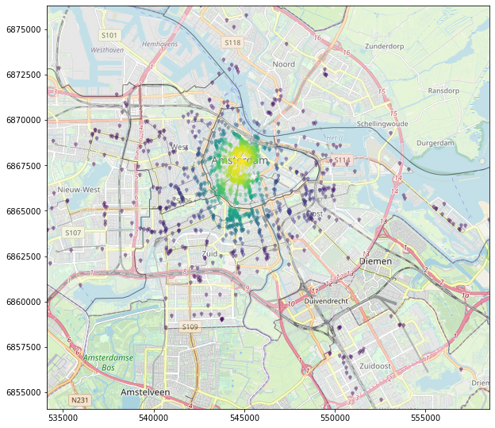
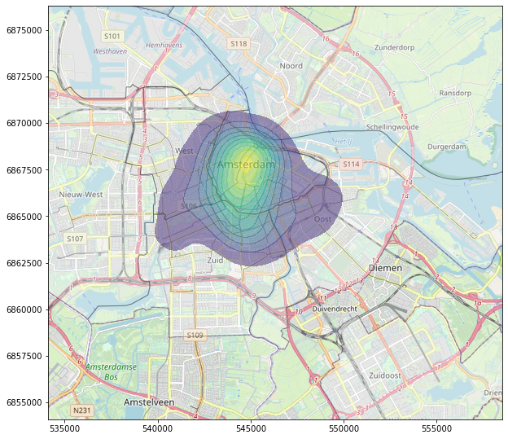

# Creating a map and KDE plot of points and polygons with Python

This tutorial teaches you how to plot map data on a background map of OpenStreetMap using Python. The [tutorial is in form of a Jupyter Notebook](code.ipynb), therefore you either install Jupyter Lab or you can also copy the code into any other editor. The results should look like the following images:





## Installation

This tutorial requires the installation of multiple packages, a few of them are not installable for windows under pip. Therefore, the packages

```bash
FionaGDAL
Rtree
Shapely
```

can be installed as wheels with this code:

```bash
pip install .\package_wheels_windows\Fiona-1.8.9-cp37-cp37m-win_amd64.whl
pip install .\package_wheels_windows\GDAL-3.0.1-cp37-cp37m-win_amd64.whl
pip install .\package_wheels_windows\Rtree-0.8.3-cp37-cp37m-win_amd64.whl
pip install .\package_wheels_windows\Shapely-1.6.4.post2-cp37-cp37m-win_amd64.whl
```

After that, the rest of the packages should be easily installable by using the provided requirements.txt file:

```bash
pip install -r requirements.txt
```
